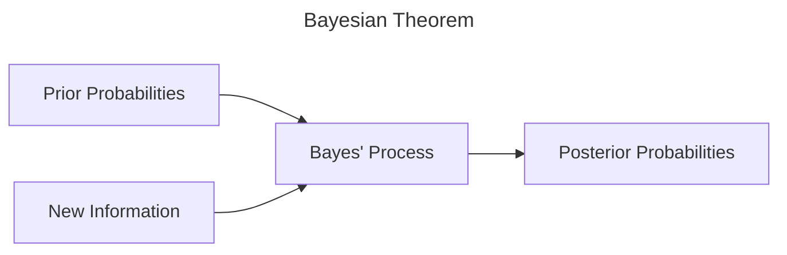

### PROBABILITY DISTRIBUTION: A REVIEW
---
==**_Probability_**== - numerical statement about the likelihood that an event will occur.
-  $0 \le P(event) \le 1$

> [!FAQ]-
> 0 = event is not likely to occur
> 1 = event is highly likely to occur

##### Types of Probability

- Objective Probability - classical or logical
- Subjective Probability - used when logic and past history are not appropriate

| OBJECTIVE PROBABILTY | SUBJECTIVE PROBABILITY |
| ---- | ---- |
| Quantitative Data | Personal Experineces |
| Deliberate Calculation | Automatic Calculation |
| The forecast is 70% chance of rain today. So, take my umbrella | It's cloudy, it may rain. So take my umbrella |

==_**Frequency_**== - the number of occurrences of a particular event within a given time.

| OBJECTIVE / CLASSICAL | SUBJECTIVE |
| ---- | ---- |
| based on equally-likely events | based on personal beliefs, experiences, prejudices, intuition, personal judgement |
| based on long-run relative frequency | different for all observers |
| not based on personal beliefs |  |
| the same for all observers |  |
| Example: toss a coin, throw a die, pick a card | Examples: election, new product, introduction, opening a new store/supermarket, weather |

#### OTHER BASIC PROBABILITY ASPECTS
---
==_**Mutually Exclusive Events**_== - one event on any one trial
	Example: Tossing a coin
		"head" & "tail"
		
==_**Collectively Exhaustive Events**_== - list all possible outcomes
	Example: Giving all possible outcomes

Examples

Mutually Exclusive
- Draw a spade & a club
- Draw a face card & a number card
- Draw an ace & a 3
- Draw a club & a non-club
- Draw a 5 & a diamond
- Draw a red card & a diamond

#### Other Basic Probability Aspects
---
- Addition of mutually exclusive events
- Addition of non-mutually exclusive events
- Statistically independent events
- Statistically dependent events
	- ==Marginal/simple probability== - on an event occurring
		- events that are currently happening
	- ==Joint== - 2 or more events occurring at the same time
		- events having 2 or more outcome/s
		- draw a red face card
	- ==Conditional== $P(A|B)$ - probability of event B, given that event A has occurred
	

> [!ADDITIONAL]-
> [[BASIC PROBABILITY EXAMPLES]]

#### PROBABILITIES WITH BAYESIAN THEOREM
---
Bayes' theorem used to incorporate additional information as it is made available and help create revised or posterior probabilities

